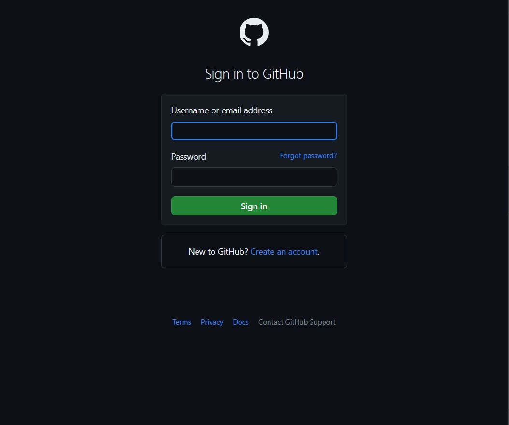

# Página de Login Inspirada no GitHub



Este é um projeto simples de uma página de login inspirada na página de login do GitHub, desenvolvida utilizando HTML e CSS.

## Curtiu?

Dê uma olhada nos outros repositórios. Sua star é bem-vinda!
Link[https://github.com/Gabriel-S-Santana/]

## Como Usar

1. Clone este repositório:

   ```bash
   git clone https://github.com/Gabriel-S-Santana/login-github.git